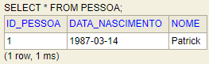
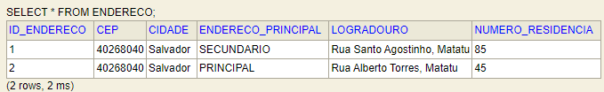
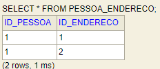
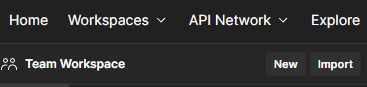
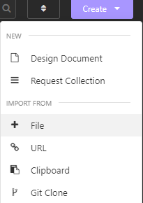
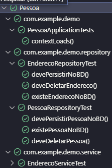
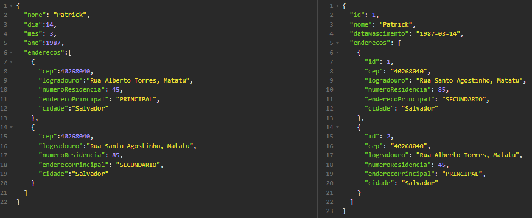
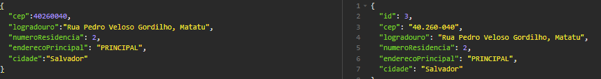
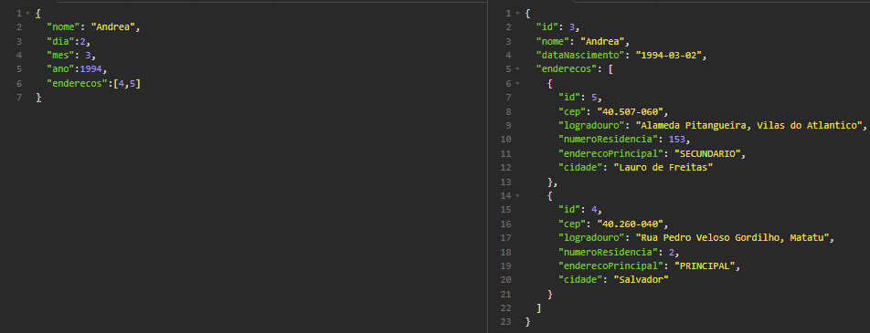

<h1 align=center> Pessoa_Spring

## Desafio java concluido ✔.

<h2 align=center> Entidade 

### No desafio foi proposto que um usuario tivesse além de seus atributos uma lista de endereços. 

<h2 align=center> Teste de Requisição

### Criei uma pasta com requisições para serem importadas tanto no insomnia ou postman.

 

<h2 align=center> Teste Unitario

### Fiz os testes unitarios do repository e service.

<h2 align=center> Service

### Tomei a decisão de criar varias opções de se salvar pessoa e endereço. Segue abaixo exemplos:

-   Criar pessoa com endereço.

-   Criar endereço separado e adiconar os endereços na criação da pessoa.

